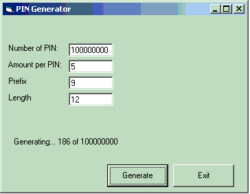



## \[A PIN Generator with Access Database\]

### Description

A simple PIN Generator with access database. Try it!!!!
 
### More Info
 
Value

             |
---                |---
**Submitted On**   |2004-06-20 16:53:00
**By**             |[Lutfur Rahman Bhuiyan](https://github.com/Planet-Source-Code/PSCIndex/blob/master/ByAuthor/lutfur-rahman-bhuiyan.md)
**Level**          |Beginner
**User Rating**    |4.4 (22 globes from 5 users)
**Compatibility**  |VB 5\.0, VB 6\.0
**Category**       |[Databases/ Data Access/ DAO/ ADO](https://github.com/Planet-Source-Code/PSCIndex/blob/master/ByCategory/databases-data-access-dao-ado__1-6.md)
**World**          |[Visual Basic](https://github.com/Planet-Source-Code/PSCIndex/blob/master/ByWorld/visual-basic.md)
**Archive File**   |[\[A\_PIN\_Gen1760026212004\.zip](https://github.com/Planet-Source-Code/lutfur-rahman-bhuiyan-a-pin-generator-with-access-database__1-54519/archive/master.zip)

